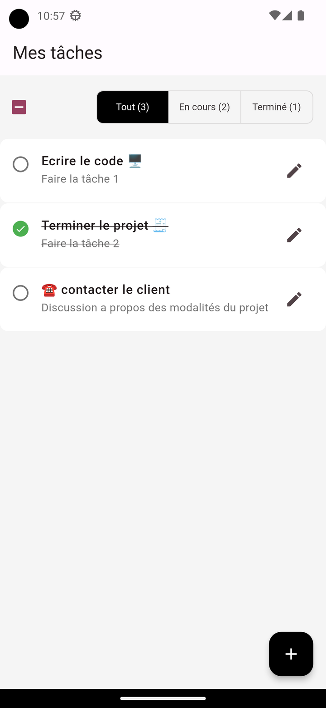

# Application Todo en Flutter 💼

Une application simple de gestion de tâches ("Todo") développée en utilisant Flutter avec une touche de Material Design.

## Fonctionnalités clés

- Interface utilisateur élégante basée sur les principes du Material Design.
- Gestion de l'état de l'application avec la librairie `provider` pour une expérience fluide.
- Fonction "Swipe to Delete" pour supprimer facilement les tâches terminées.
- Checkbox globale avec état tristate pour marquer, démarquer et compléter les tâches.
- Utilisation de `ToggleButtons` pour filtrer les tâches affichées en fonction de leur état (Tout, Actif, Terminé).

## Installation

1. Assurez-vous d'avoir Flutter installé. Si ce n'est pas le cas, suivez les instructions sur [le site officiel de Flutter](https://flutter.dev/docs/get-started/install).
2. Clonez ce dépôt : `git clone https://github.com/lepresk/todo-flutter-app.git`
3. Accédez au répertoire du projet : `cd todo-flutter-app`
4. Exécutez l'application : `flutter run`

---

Code écrit avec du 💖 et de l'amour 🥰. Nous espérons que vous apprécierez utiliser cette application autant que nous avons aimé la développer.
